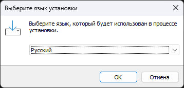
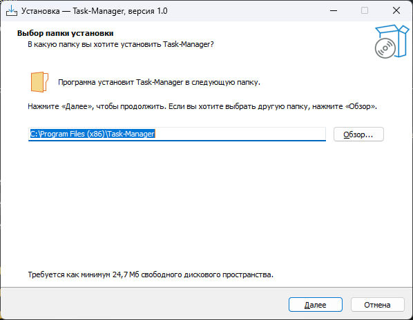
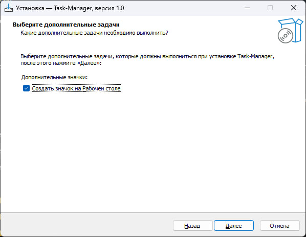
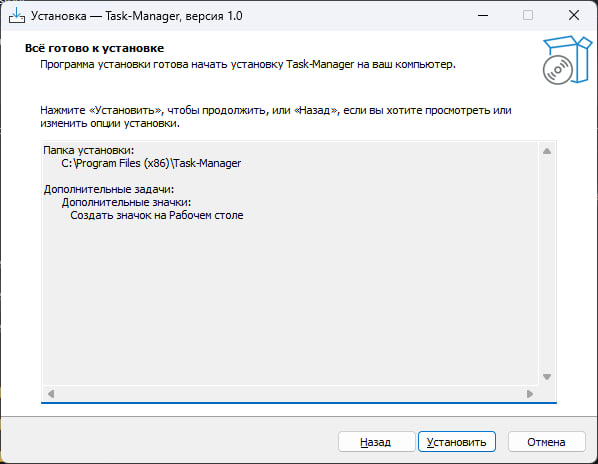

## Установка
**Запуск приложения:**
* Скачайте приложение с через установщик Task-Manager
  

## Контент
Файл содержащий ссылки на всю документацию - [Контент](TaskManager/Документы/Контент.md)
  * Руководство пользователя
     * [Руководство пользователя](TaskManager/Документы/Руководство_пользователя.md)
       
  * Требования
    * [Системные требования](TaskManager/Документы/Системные_требования.md)
    * [Функциональные требования](TaskManager/Документы/Функциональные_требования.md)
      
  * Документация
    * [Архитектура системы](TaskManager/Документы/Архитектура_системы.md)
    * [Назначение программы](TaskManager/Документы/Назначение_программы.md)
    * [Пользователи и бизнес-процессы](TaskManager/Документы/Пользователи_и_бизнес-процессы.md)
    * [Развертывание и настройка](TaskManager/Документы/Развертывание_и_настройка.md)
    * [Анализ рисков](TaskManager/ДокументыУЧ/Анализ_рисков.md)
    * [Документация для разработчиков](TaskManager/ДокументыУЧ/Документация_для_разработчиков.md)
    * [План внедрения](TaskManager/ДокументыУЧ/План_внедрения.md)

  * Диаграммы
    * [Диаграмма Ганта](TaskManager/Документы/Диаграммы_png/Диаграмма_Ганта.jpg)
    * [Диаграмма Классов](TaskManager/Документы/Диаграммы_png/ДиаграммаКлассов.jpg)
    * [Диаграмма Последовательностей](TaskManager/Документы/Диаграммы_png/ДиаграммаПоследовательностей.png)
    * [Диаграмма Прецедентов](TaskManager/Документы/Диаграммы_png/ДиаграммаПрецедентов.jpg)
